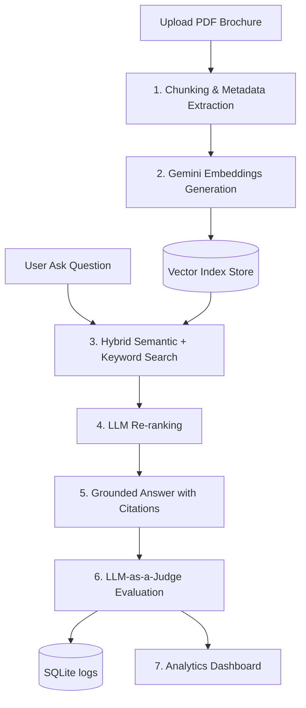

# 🚗 DriveWise — Metadata-Aware Automotive RAG Assistant

> **Live Streamlit App**: [drivewiseapp.streamlit.app](https://drivewiseapp-mxwoyuqx563zbik6ycvw2b.streamlit.app/)

DriveWise is an interactive, AI-powered automotive assistant designed to make car buyers' and owners' decisions easier. Instead of scrolling through dry, 50-page PDF brochures, DriveWise lets you chat with brochures directly and get grounded, cited answers about any car's specifications, safety features, mileage, or dimensions.

---

## 🛠️ The Tech Behind DriveWise (Step-by-Step Pipeline)

Here is how DriveWise processes brochures and answers your questions under the hood:



### 1. Ingestion & Reading (The Library)
* **What happens**: When a car brochure PDF is loaded, DriveWise reads it page-by-page.
* **Metadata Extraction**: It uses Gemini to analyze the cover page, automatically identifying the **Brand**, **Model**, and **Document Version** (e.g., *v2024*, *MY23*).
* **Smart Chunking**: It breaks down the long text into readable paragraph chunks (~800 characters) and categorizes them into sections (e.g., *Safety*, *Engine & Performance*, *Dimensions*, *Infotainment*) using a keyword classifier.

### 2. Digital Fingerprinting (Embeddings)
* **What happens**: Every text chunk is fed to Google's `gemini-embedding-001` model.
* **Why**: The model converts words into a list of numbers (a 768-dimensional vector) representing the *meaning* of the text. If two sentences talk about similar concepts (e.g., "Airbags" and "Passenger protection"), their numbers will be mathematically close.

### 3. The Search (Hybrid Retrieval)
When you ask a question like *"Does the Creta have a sunroof?"*:
* **Semantic Match**: DriveWise calculates the embedding of your question and searches the database for chunks with the most similar meaning.
* **Keyword Match**: It filters out common stopwords and does an exact text search for words like "Creta" and "sunroof".
* **Combination**: It merges both scores (80% weight on meaning, 20% weight on exact keywords) to select the top candidate excerpts.

### 4. The Librarian (LLM Re-ranking)
* **What happens**: The raw search results might contain slightly off-topic text. DriveWise sends the top candidate chunks to `gemini-flash-latest` and asks it to re-rank them strictly by how well they answer your specific question.
* **Why**: This ensures the most relevant pages are positioned at the very top, giving the final answering model the best context.

### 5. Grounded Answering (Generation)
* **What happens**: DriveWise packages your question and the top 4 re-ranked brochure excerpts into a prompt.
* **Strict Guardrails**: The model is instructed to answer *only* using the provided excerpts. If the information isn't in the brochure, it will state that it's missing (preventing hallucinations).
* **Citations**: It automatically appends inline footnotes like `[1]` or `[2]`, mapping directly to the source page, section, and brochure version.

### 6. The Quality Judge (Evaluation & Logging)
* **What happens**: As soon as the answer is generated, a background evaluator (`gemini-flash-latest`) grades the quality on a scale of `1.0` to `5.0` based on:
  * **Faithfulness**: Is the answer fully grounded in the text (no lying)?
  * **Context Relevance**: Did the retriever fetch the right pages?
  * **Answer Correctness**: Did the assistant answer the user's question completely?
* **Database**: All scores, response times, questions, and retrieved chunks are saved in a local SQLite database (`logs/query_logs.db`).

### 7. Interactive Analytics Dashboard
* View total queries, average response latency, and failure rates.
* Monitor average RAG quality scores (Faithfulness, Relevance, Correctness) mapped out in bar charts.
* Check query distributions by car model.

---

## 🚀 Running Locally

### Prerequisites
Make sure Python 3.10+ is installed.

### Installation
1. Clone the repository:
   ```bash
   git clone https://github.com/avanishar/drivewiseapp.git
   cd drivewiseapp
   ```
2. Install the dependencies:
   ```bash
   pip install -r requirements.txt
   ```
3. Set your Google Gemini API key:
   * **Windows (PowerShell)**:
     ```powershell
     $env:GOOGLE_API_KEY="your_api_key_here"
     ```
   * **Linux/macOS**:
     ```bash
     export GOOGLE_API_KEY="your_api_key_here"
     ```

### Run the App
Start the Streamlit interface:
```bash
streamlit run app.py
```
Open `http://localhost:8501` in your browser.
